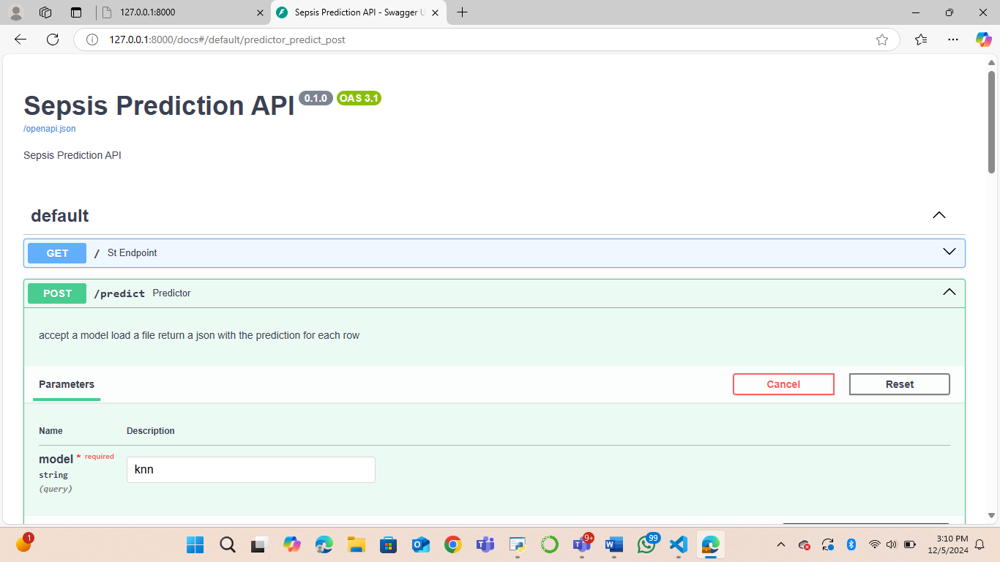
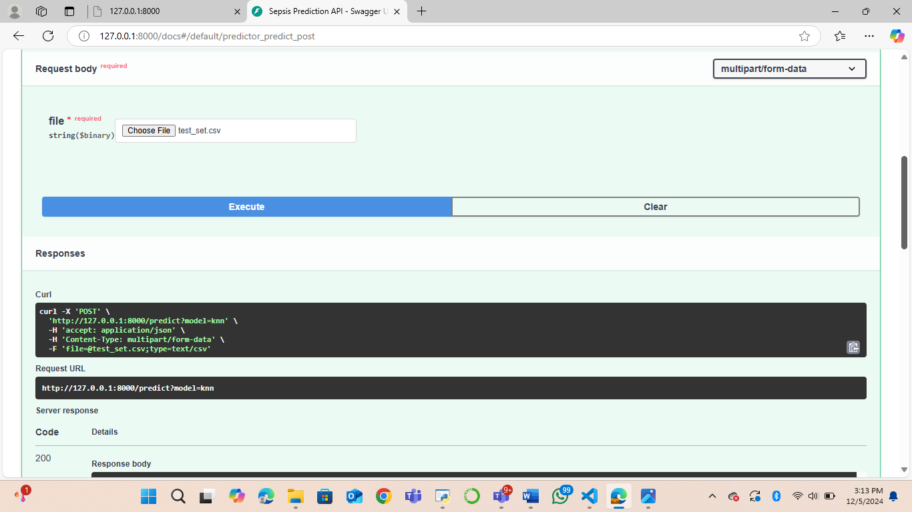
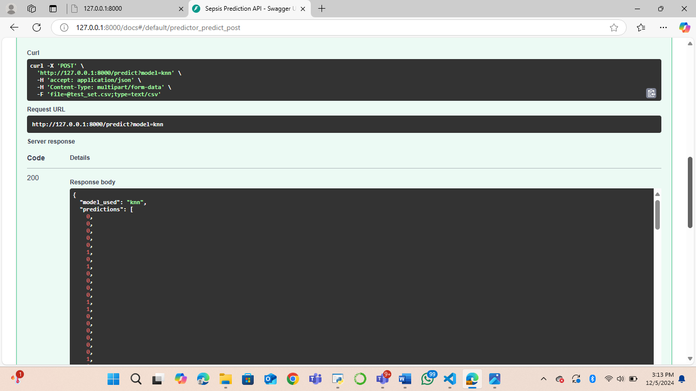
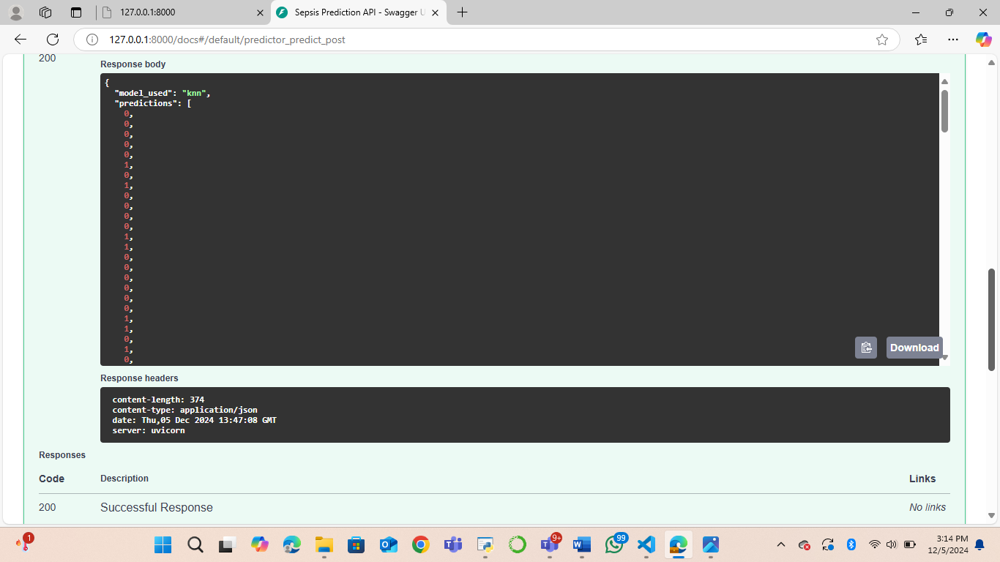
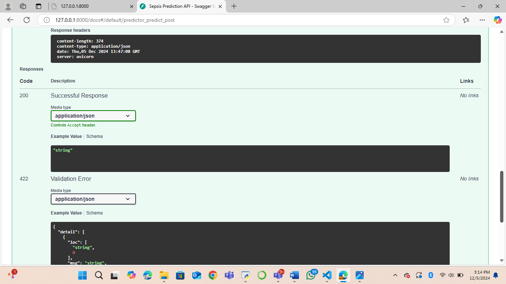
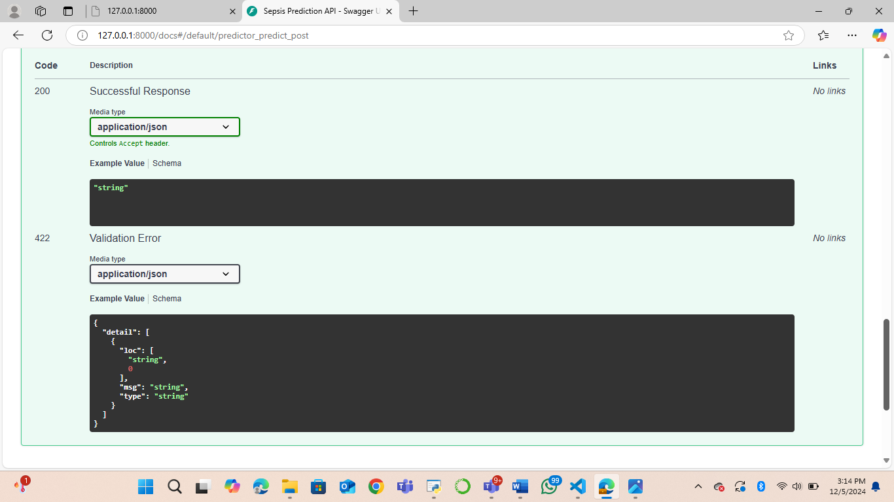
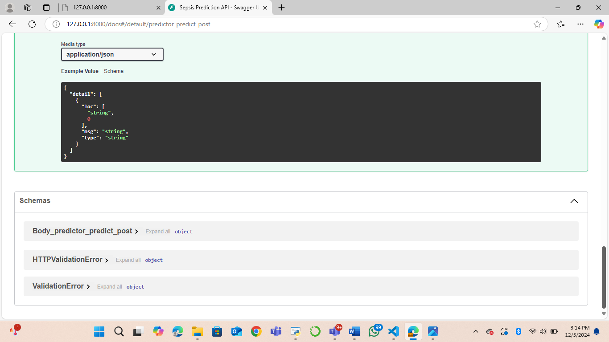

### Sepsis Prediction 

## Overview  
This dataset is a modified version of a publicly available data source, designed for use in a sepsis prediction project. The primary goal is to predict whether ICU patients will develop sepsis based on clinical and demographic data. This dataset is for academic purposes only and is subject to usage restrictions as outlined in the license agreement.


## Donor Information
The Johns Hopkins University  
Johns Hopkins Road, Laurel, MD 20707  
Contact: (301) 953-6231  


## License Agreement 
This dataset is provided solely for the purpose of this assignment. Sharing, distributing, or using this dataset for any other commercial or non-commercial purposes is strictly prohibited.


## Dataset Description

The dataset contains attributes related to patient health, clinical measurements, and demographic data. Below is a detailed description of each field:

| Column Name |           Type       |        Description                                                                |
|------------------|----------------|---------------------------------------------------------------------------------|
| **ID**          | Identifier     | Unique identifier for each patient.                                            |
| **PRG**         | Numeric        | Plasma glucose level.                                                          |
| **PL**          | Numeric        | Blood Work Result-1 (mu U/).                                                   |
| **PR**          | Numeric        | Blood pressure (mm Hg).                                                        |
| **SK**          | Numeric        | Blood Work Result-2 (mm).                                                      |
| **TS**          | Numeric        | Blood Work Result-3 (mu U/ml).                                                 |
| **M11**         | Numeric        | Body Mass Index (BMI) in kg/m² (weight divided by height squared).             |
| **BD2**         | Numeric        | Blood Work Result-4 (mu U/ml).                                                 |
| **Age**         | Numeric        | Patient's age (years).                                                         |
| **Insurance**   | Categorical    | Indicates whether the patient has valid insurance coverage (Yes/No).           |
| **Sepsis**      | Target Variable| Binary indicator for sepsis diagnosis ("Positive" or "Negative").              |


## **Setup**  
Follow these steps to set up the project:

1. **Clone the repository**:  
   ```bash
   git clone <repository-url>
   cd <repository-folder>
   ```

2. **Install dependencies**:  
   Install the required Python libraries using:  
   ```bash
   pip install -r requirements.txt
   ```

3. **Load the dataset**:  
   Place the dataset file in the appropriate directory as specified in the project configuration.

4. **Run the application**:  
   Execute the main script to analyze or train models. Example:  
   ```bash
   python app.py
   ```

---

## Usage Information
- Purpose: Predict whether a patient in the ICU will develop sepsis based on their clinical and demographic data.  
- Target Variable: ** Sepsis (Binary classification: "Positive" or "Negative").  
- **Attributes**: Includes health indicators such as glucose levels, blood work results, BMI, age, and more.  


## Screenshots 


 
 

 
 


Swagger UI Link: Sepsis Prediction API - Swagger UI


## Author
Geomeife Elizabeth Odelade


 